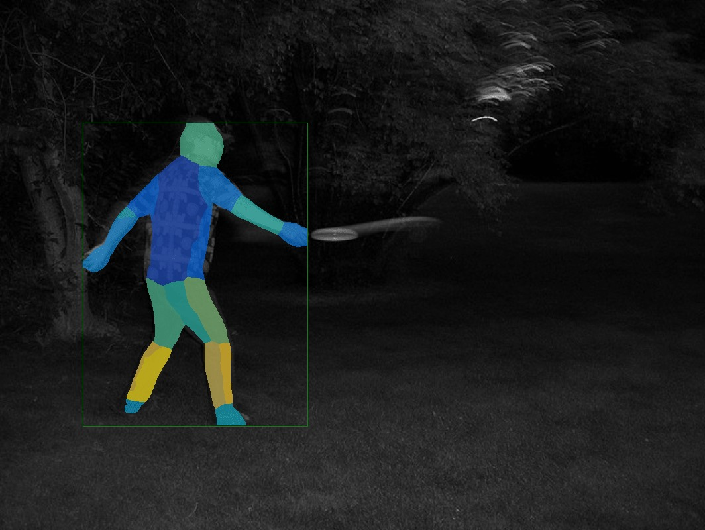
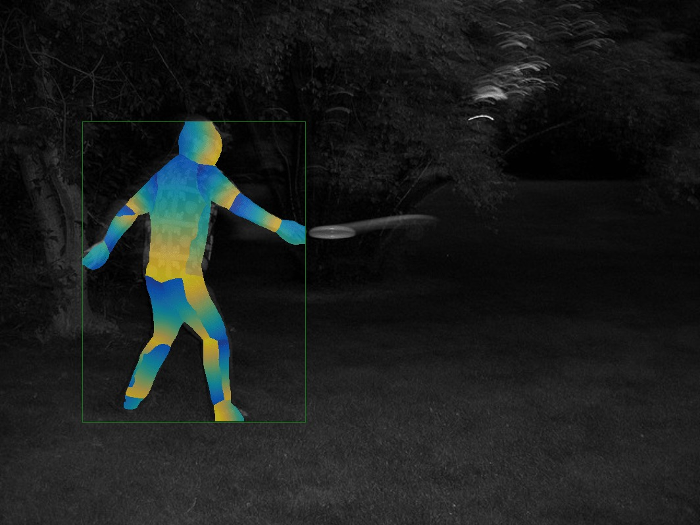
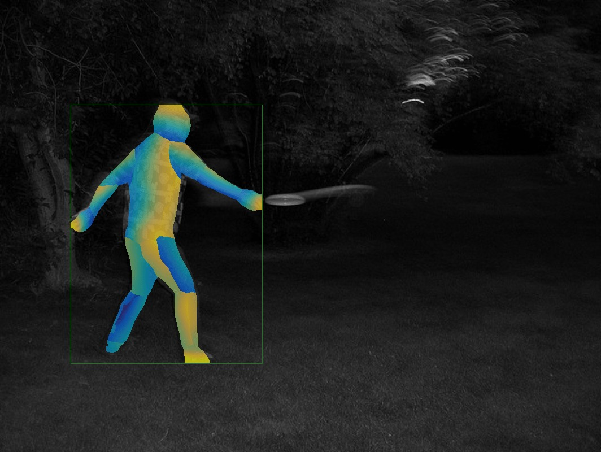
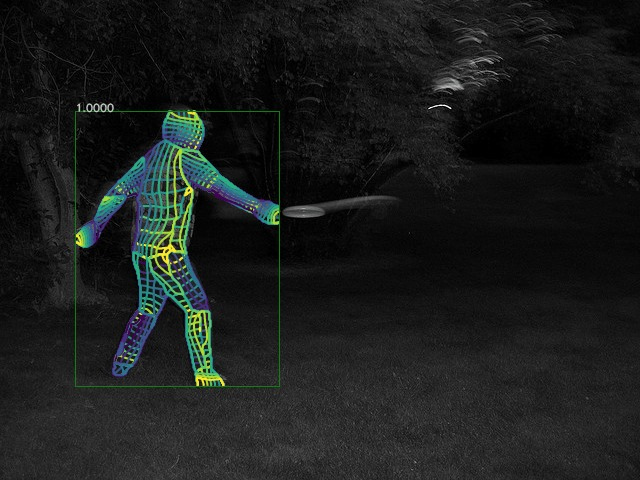

# Apply Net

`apply_net` is a tool to print or visualize DensePose results on a set of images.
It has two modes: `dump` to save DensePose model results to a pickle file
and `show` to visualize them on images.

## Dump Mode

The general command form is:
```bash
python apply_net.py dump [-h] [-v] [--output <dump_file>] <config> <model> <input>
```

There are three mandatory arguments:
 - `<config>`, configuration file for a given model;
 - `<model>`, model file with trained parameters
 - `<input>`, input image file name, pattern or folder

One can additionally provide `--output` argument to define the output file name,
which defaults to `output.pkl`.


Examples:

1. Dump results of a DensePose model with ResNet-50 FPN backbone for images
   in a folder `images` to file `dump.pkl`:
```bash
python apply_net.py dump configs/densepose_rcnn_R_50_FPN_s1x.yaml DensePose_ResNet50_FPN_s1x-e2e.pkl images --output dump.pkl -v
```

2. Dump results of a DensePose model with ResNet-50 FPN backbone for images
   with file name matching a pattern `image*.jpg` to file `results.pkl`:
```bash
python apply_net.py dump configs/densepose_rcnn_R_50_FPN_s1x.yaml DensePose_ResNet50_FPN_s1x-e2e.pkl "image*.jpg" --output results.pkl -v
```


If you want to load the pickle file of DensePose model results: 
```
f = open('/your_result_path/result.pkl', 'rb')
data = pickle.load(f)
```


The pickle loading code should be run in the `/your_detectron2_path/detectron2_repo/projects/DensePose/` directory, 
or `ModuleNotFoundError: No module named 'densepose'` will occur. 

If you have to run the code in other directory, simply add this before pickle loading:
```
import sys
sys.path.append("/your_detectron2_path/detectron2_repo/projects/DensePose/")
```

The file `result.pkl` contains the list of results per image, for each image the result is a dictionary:
```
data: [{'file_name': '/your_path/image1.jpg', 
        'scores': tensor([0.9884]), 
        'pred_boxes_XYXY': tensor([[ 69.6114,   0.0000, 706.9797, 706.0000]]), 
        'pred_densepose': <densepose.structures.DensePoseResult object at 0x7f791b312470>}, 
       {'file_name': '/your_path/image2.jpg', 
        'scores': tensor([0.9999, 0.5373, 0.3991]), 
        'pred_boxes_XYXY': tensor([[ 59.5734,   7.7535, 579.9311, 932.3619],
                                   [612.9418, 686.1254, 612.9999, 704.6053],
                                   [164.5081, 407.4034, 598.3944, 920.4266]]), 
        'pred_densepose': <densepose.structures.DensePoseResult object at 0x7f7071229be0>}]

```

DensePose results are stored under `'pred_densepose'` key, which is an instance of DensePoseResult class. 
The `'pred_densepose'` object is encoded as a string, 
thus you can use `DensePoseResult.decode_png_data()` to decode the string and extract the IUV array. 
For each image, `densepose_result.results` may contain several iuv_arrays, here we choose the first one which has the highest detection score as the IUV array. 
```
img_id = 2  # Which image to extract IUV array from

densepose_result = data[img_id]['pred_densepose']
for i, result_encoded_w_shape in enumerate(densepose_result.results):
    iuv_arr = DensePoseResult.decode_png_data(*result_encoded_w_shape)
    bbox_xywh = densepose_result.boxes_xywh[i]
    break
```
The array `bbox_xywh` consists of x-coordinate, y-coordinate, width, and height of the bounding box. The shape of `iuv_arr` is `[3, height of the bounding box, width of the bounding box]`, and the data format of `iuv_arr` is:

-   `iuv_arr[0,:,:]`: The patch index of image points, indicating which of the 24 surface patches the point is on.
-   `iuv_arr[1,:,:]`: The U-coordinate value of image points.
-   `iuv_arr[2,:,:]`: The V-coordinate value of image points.


## Visualization Mode

The general command form is:
```bash
python apply_net.py show [-h] [-v] [--min_score <score>] [--nms_thresh <threshold>] [--output <image_file>] <config> <model> <input> <visualizations>
```

There are four mandatory arguments:
 - `<config>`, configuration file for a given model;
 - `<model>`, model file with trained parameters
 - `<input>`, input image file name, pattern or folder
 - `<visualizations>`, visualizations specifier; currently available visualizations are:
   * `bbox` - bounding boxes of detected persons;
   * `dp_segm` - segmentation masks for detected persons;
   * `dp_u` - each body part is colored according to the estimated values of the
     U coordinate in part parameterization;
   * `dp_v` - each body part is colored according to the estimated values of the
     V coordinate in part parameterization;
   * `dp_contour` - plots contours with color-coded U and V coordinates


One can additionally provide the following optional arguments:
 - `--min_score` to only show detections with sufficient scores that are not lower than provided value
 - `--nms_thresh` to additionally apply non-maximum suppression to detections at a given threshold
 - `--output` to define visualization file name template, which defaults to `output.png`.
   To distinguish output file names for different images, the tool appends 1-based entry index,
   e.g. output.0001.png, output.0002.png, etc...


The following examples show how to output results of a DensePose model
with ResNet-50 FPN backbone using different visualizations for image `image.jpg`:

1. Show bounding box and segmentation:
```bash
python apply_net.py show configs/densepose_rcnn_R_50_FPN_s1x.yaml DensePose_ResNet50_FPN_s1x-e2e.pkl image.jpg bbox,dp_segm -v
```


2. Show bounding box and estimated U coordinates for body parts:
```bash
python apply_net.py show configs/densepose_rcnn_R_50_FPN_s1x.yaml DensePose_ResNet50_FPN_s1x-e2e.pkl image.jpg bbox,dp_u -v
```


3. Show bounding box and estimated V coordinates for body parts:
```bash
python apply_net.py show configs/densepose_rcnn_R_50_FPN_s1x.yaml DensePose_ResNet50_FPN_s1x-e2e.pkl image.jpg bbox,dp_v -v
```


4. Show bounding box and estimated U and V coordinates via contour plots:
```bash
python apply_net.py show configs/densepose_rcnn_R_50_FPN_s1x.yaml DensePose_ResNet50_FPN_s1x-e2e.pkl image.jpg dp_contour,bbox -v
```

